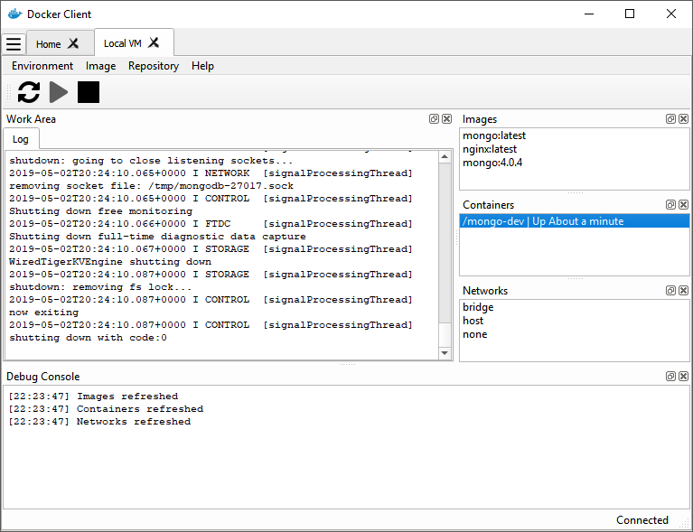

# Docker Client GUI
Docker Client GUI written in Python

# Requirements
- PyQt 5.11 (https://github.com/baoboa/pyqt5/)
- Docker Python Library (https://github.com/docker/docker-py)
- Paramiko Library(https://github.com/paramiko/paramiko/)
- YAML Python Library (https://pyyaml.org/)

# Examples
- [1-dimensional List View (MVC-style)](example/listview_mvc)
- [SSH Adapter (and info about setting up SSH config)](example/ssh_connection)

# Screenshot

