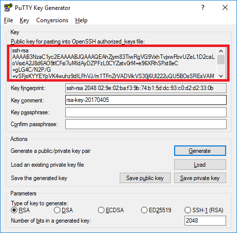
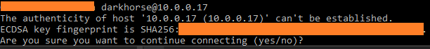

# Using -Docker Client via SSH Example
## Prerequisites:
### For Windows 10:
- Git Bash for Windows: ([Download here](https://git-scm.com/downloads))
- PuTTYgen and Pagent version 0.70 or higher ([Download here](https://www.chiark.greenend.org.uk/~sgtatham/putty/latest.html))

## Background
The Python Docker library establishes a SSH connection with public-key authentication, thus no password should be prompted from
the server.

If you have not dealt with SSH before [watch the video here](https://www.youtube.com/watch?v=PXi-39elr6Y) to understand
the basics of SSH connections.

### For Windows 10:
Install the prerequisite software before continuing. If you already have OpenSSH installed on your Windows machine,
it would not be necessary to install Git For Windows
If you have not created a .ssh folder then create one at <code>/%username%/.ssh</code>. This is where your private and public key should be located.
The reason I use PuTTY is because it has a component/program called Pagent, which Paramiko (the library used for SSH'ing in the Docker Client)
to act as the SSH agent.
For safety and simplicity one should generate private and public key with PuTTYgen.
When I asked for a passphrase I left it empty. Did not test with a passphrase yet.
When you have generated your private and public key, save them in the /%username%/.ssh folder
As shown in the screenshot the text within the red block should be copied onto your Linux-based server into a file
called <code>authorized_keys</code> located at <code>~/%remote_user%/.ssh/</code>.

If you installed Git For Windows, you can launch Git Bash or else Command Prompt.
Type in:
<code>ssh %remote_user%@%remote_host%</code>
For example: <code> ssh darkhorse@10.0.0.17 </code>

If connection is established it would prompt the following:

If you type in 'yes', then it will create an public key entry in <code>/%username%/.ssh/known_hosts</code> file.
It will from now on always trust the host.

If your public-key authentication is setup correctly on your server (the server where the Docker Daemon is running), then
it won't prompt for a password anymore and use your public key to authenticate.

If this is not the case then some settings needs to be checked still.
For Ubuntu Linux, see [here](https://help.ubuntu.com/community/SSH/OpenSSH/Keys#Troubleshooting)

I am at this point still busy figuring out how to SSH to a Docker Daemon using the Python Docker library.
The above-mentioned text is just some stuff I picked up, which is not very clearly documented anywhere.

Any feedback is more than welcome :)
